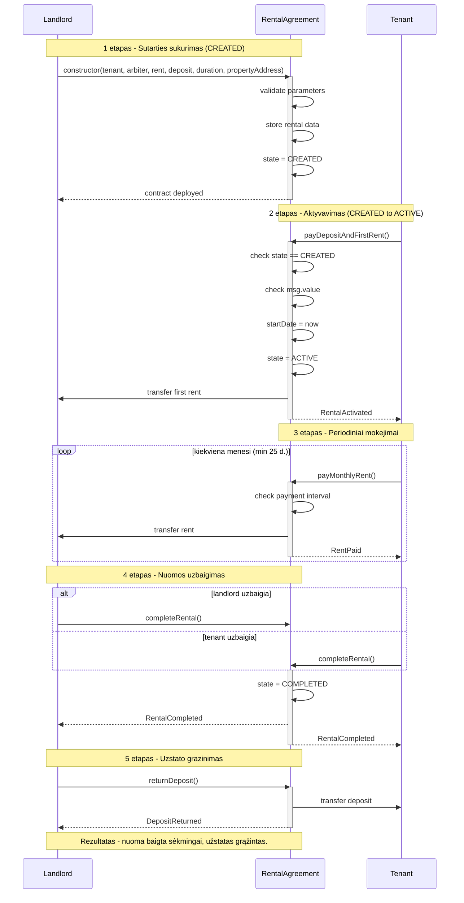
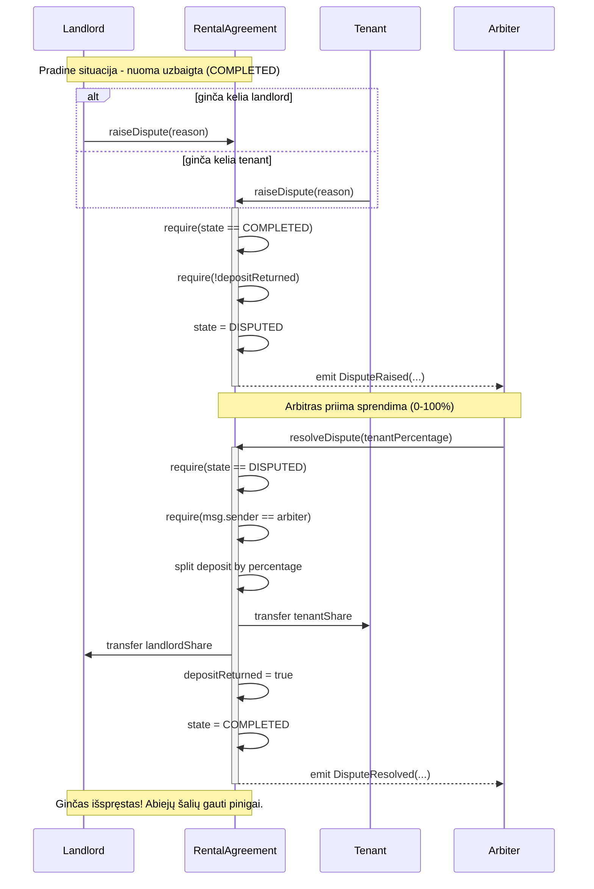
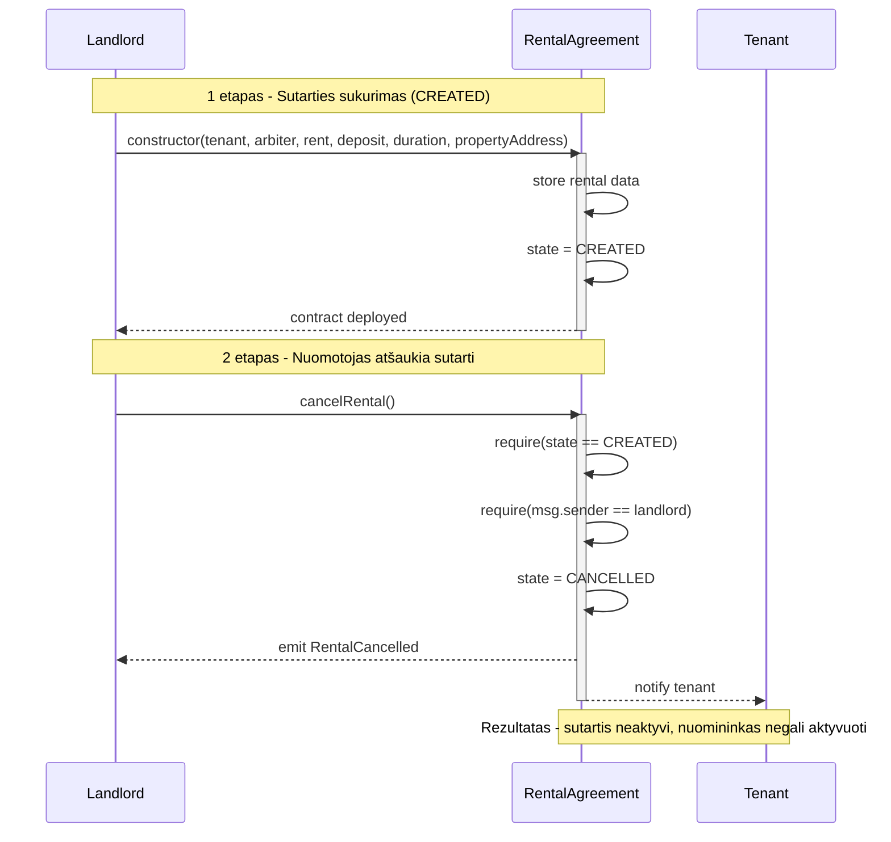

# Nekilnojamojo Turto Nuomos Išmanioji Sutartis

## Projekto Aprašymas

Decentralizuota aplikacija, kuri įgyvendina nekilnojamojo turto nuomos sutartį kaip **smart contract** su:
- **užstato (deposit)** mechanizmu,
- **periodiniais mėnesiniais mokėjimais**,
- **ginčo sprendimu per arbitrą** (3-ioji šalis),
- **Front-End DApp** (MetaMask + Web3.js), leidžiančia valdyti sutartį.

Verslo modelis pasirinktas **skirtingas nuo pavyzdžio** (ne prekių pardavimas, o ilgalaikė nuoma su periodiniais mokėjimais ir ginčais).

---

## Užduoties punktai

1. **Verslo modelis** aprašytas (veikėjai + scenarijai).
2. Pasirinktas kelių šalių modelis: **Landlord / Tenant / Arbiter**.
3. Pateiktos **sekų diagramos (Mermaid)** ir veiksmų aprašymai.
4. Verslo logika realizuota **Solidity** smart contract’e.
5. Ištestuota lokaliai (**Ganache**).
6. Ištestuota viešame testnet’e (**Sepolia**).
7. Peržiūrėti contract vykdymo įvykiai (logs) per **Etherscan**.
8. Sukurtas **Front-End DApp**, komunikuojantis su smart contract.
---

## Pagrindiniai dalyviai

### 1. Nuomotojas (Landlord)
**Rolė:** turto savininkas, sukuriantis sutartį ir valdantis uždarymą / užstatą.

**Pagrindinės funkcijos:**
- `constructor()` – sukuria sutartį su parametrais
- `completeRental()` – užbaigia nuomos laikotarpį
- `returnDeposit()` – grąžina užstatą (jei nėra ginčo)
- `raiseDispute(reason)` – kelia ginčą
- `cancelRental()` – atšaukia sutartį iki aktyvavimo

**Finansiniai Srautai:**

- **Gauna:** Mėnesinius nuomos mokėjimus (automatiškai)
- **Gali gauti:** Dalį užstato (ginčo atveju)

**Atsakomybės:**

- Užtikrinti, kad turtas yra tinkamas nuomai
- Grąžinti užstatą sąžiningai, jei nėra žalos

---

### 2. Nuomininkas (Tenant)
**Rolė:** asmuo, kuris aktyvuoja sutartį, moka nuomą ir gali inicijuoti ginčą.

**Pagrindinės funkcijos:**
- `payDepositAndFirstRent()` – sumoka užstatą + pirmą nuomą ir aktyvuoja sutartį
- `payMonthlyRent()` – atlieka mėnesinį mokėjimą (su laiko taisykle)
- `completeRental()` – gali užbaigti pasibaigus terminui
- `raiseDispute(reason)` – kelia ginčą

**Finansiniai Srautai:**

- **Moka:** Užstatą (vieną kartą) + mėnesinę nuomą (periodiškai)
- **Gauna atgal:** Užstatą (pilną arba dalį)

**Atsakomybės:**

- Mokėti nuomą laiku
- Prižiūrėti turtą ir grąžinti jį tvarkingą būklę

---

### 3. Arbitras (Arbiter)
**Rolė:** neutrali trečioji šalis ginčų atveju.

**Pagrindinė funkcija:**
- `resolveDispute(tenantPercentage)` – paskirsto užstatą procentais (0–100).

**Atsakomybės:**

- Objektyviai įvertinti situaciją
- Priimti teisingą sprendimą pagal faktus

---

### Veikėjų Sąveika

```
┌─────────────┐          ┌──────────────┐          ┌────────────┐
│ Nuomotojas  │────────▶ │Smart Contract│◀────────│Nuomininkas │
│ (Landlord)  │          │              │          │ (Tenant)   │
└─────────────┘          └──────────────┘          └────────────┘
                              ▲
                              │
                              │ (Ginčo atveju)
                              │
                        ┌─────┴──────┐
                        │  Arbitras  │
                        │ (Arbiter)  │
                        └────────────┘
```

---

## Verslo Scenarijai

### Sutarties Būsenos (States)

Smart contract naudoja **State machine**:

- `CREATED` – sutartis sukurta, laukia aktyvavimo (deposit + first rent)
- `ACTIVE` – nuoma aktyvi, vyksta periodiniai mokėjimai
- `COMPLETED` – nuoma užbaigta (galima grąžinti užstatą arba kelti ginčą)
- `DISPUTED` – užstatas “užšaldytas”, laukia arbitro sprendimo
- `CANCELLED` – sutartis atšaukta iki aktyvavimo

```
┌─────────┐  payDeposit   ┌────────┐  complete     ┌───────────┐
│ CREATED │──────────────▶│ ACTIVE │─────────────▶│ COMPLETED │
└─────────┘               └────────┘               └───────────┘
     │                         │                         │
     │ cancel                  │                         │ raiseDispute
     ▼                         │                         ▼
┌───────────┐                  │                   ┌──────────┐
│ CANCELLED │                  │                   │ DISPUTED │
└───────────┘                  │                   └──────────┘
                               │                         │
                               │                         │ resolveDispute
                               ▼                         ▼
                       ┌────────────────┐         ┌───────────┐
                       │ PAYMENT_PENDING│         │ COMPLETED │
                       └────────────────┘         └───────────┘
```

---

### Scenarijus A: Sėkminga nuoma
1. Landlord deploy’ina contract (`CREATED`)
2. Nuomininkas kviečia `payDepositAndFirstRent()` → contract perveda pirmą nuomą landlord’ui, deposit lieka contract’e (`ACTIVE`)
3. Nuomininkas periodiškai kviečia `payMonthlyRent()` → automatinis pervedimas landlord’ui
4. Pasibaigus terminui kviečiamas `completeRental()` (`COMPLETED`)
5. Landlord kviečia `returnDeposit()` → deposit grąžinamas Nuomininkui

### Scenarijus B: Ginčas
1–4 kaip A scenarijuje iki `COMPLETED`
5. Landlord arba nuomininkas kviečia `raiseDispute(reason)` → (`DISPUTED`)
6. Arbitras kviečia `resolveDispute(tenantPercentage)` → užstatas paskirstomas, būsena grįžta į `COMPLETED`

### Scenarijus C: Atšaukimas iki pradžios
1. Landlord deploy’ina contract (`CREATED`)
2. Landlord kviečia `cancelRental()` → (`CANCELLED`)
3. Nuomininkas nebegali aktyvuoti sutarties

---

## Sekų diagramos (Sequence Diagrams)

### 1. Sėkminga nuoma



#### **Veiksmai ir jų aprašymai:**

1) **constructor(...)** *(Landlord)*
- Deploy’inamas smart contract ir nustatomi parametrai: `tenant`, `arbiter`, `rent`, `deposit`, `duration`, `propertyAddress`.
- tikrinami duomenys (`require`).
- Pradinė būsena: `CREATED`.

2) **payDepositAndFirstRent()** *(Tenant)*
- Nuomininkas sumoka `deposit + rent` (ETH) ir aktyvuoja sutartį.
- Contract patikrina būseną ir sumą, perveda **pirmą nuomą** nuomotojui.
- Užstatas lieka contract’e kaip **escrow**.
- Būsena: `CREATED -> ACTIVE`.

3) **payMonthlyRent()** *(Tenant, kartojama)*
- Kas mėnesį atliekamas `rent` mokėjimas.
- Contract tikrina minimalų intervalą (pvz. `>= 25 days`), atnaujina `lastPaymentDate`.
- Pinigai automatiškai pervedami nuomotojui.

4) **completeRental()** *(Landlord arba Tenant)*
- Gali kviesti bet kuri šalis, kai pasibaigė `endDate`.
- Contract patikrina terminą ir užbaigia nuomą.
- Būsena: `ACTIVE -> COMPLETED`.

5) **returnDeposit()** *(Landlord)*
- Jei nėra pretenzijų, nuomotojas grąžina užstatą.
- Contract perveda visą `deposit` nuomininkui ir pažymi `depositReturned = true`.


---

### 2. Ginčo scenarijus



#### **Veiksmai ir Jų Aprašymai:**

- `raiseDispute()` (Ginčo kėlimas):<br/>
Leidžiama tik kai nuoma baigta (COMPLETED) ir užstatas dar negrąžintas. Užstatas „užšaldomas“, būsena pereina į DISPUTED.

- `resolveDispute`(tenantPercentage): <br/>
Tik arbitras nustato procentą (0–100), contract automatiškai paskirsto užstatą abiem šalims ir uždaro ginčą.
---

### 3. Sutarties atšaukimo scenarijus (Cancellation)



#### **Veiksmai ir Jų Aprašymai:**

1. `constructor()` (Landlord)
- Sukuriama nauja nuomos sutartis.
- Nustatomi visi parametrai ir išsaugomi contract’e.
- Pradinė būsena: CREATED.

2. cancelRental() (tik Landlord)
- Leidžiama tik būsenoje CREATED (kol dar nesumokėtas užstatas).
- Sutartis atšaukiama be jokių finansinių pasekmių.
- Būsena pakeičiama į CANCELLED.
- Nuomininkas nebegali aktyvuoti sutarties.

*Kodėl tai svarbu:* Šis scenarijus suteikia nuomotojui lankstumą iki sutarties pradžios ir užtikrina, kad nė viena šalis nepatirtų finansinių nuostolių, jei nuoma neįvyksta.

## Technologijos

- **Blockchain**: Ethereum (Sepolia Testnet)
- **Smart Contract**: Solidity ^0.8.0
- **Development Framework**: Truffle
- **Local Testing**: Ganache
- **Wallet**: MetaMask
- **API Provider**: Infura
- **Frontend**: HTML, CSS, JavaScript, Web3.js

## Įdiegimas ir Paleidimas

### 1. Priklausomybių Įdiegimas

```bash
npm install
```

Įdiekite reikiamus paketus:

```bash
npm install dotenv @truffle/hdwallet-provider
```

### 2. Konfigūracija

Sukurkite `.env` failą pagal `.env.example`:

```bash
MNEMONIC="your twelve word seed phrase from MetaMask"
INFURA_API_KEY="your_infura_api_key"
```

*Infura API Key gavimas:*
1. Užsiregistruokite https://infura.io
2. Sukurkite naują projektą
3. Nukopijuokite API Key

### 3. Paleiskite Ganache

Atidarykite Ganache aplikaciją ir įsitikinkite, kad naudojamas lokalaus tinklo adresas `127.0.0.1` ir ji veikia ant porto `7545`.

### 4. Kompiliavimas

```bash
truffle compile
```

### 5. Testavimas Lokaliame Tinkle

```bash
truffle test --network development
```

### 6. Migration į Ganache

```bash
truffle migrate --network development
```

### 7. Deployment į Sepolia Testnet

Įsitikinkite, kad turite Sepolia ETH MetaMask wallet'e:

```bash
truffle migrate --network sepolia
```

## Testavimas

Projektui sukurti išsamūs testai (`test/RentalAgreement.test.js`):

```bash
truffle test
```

Testai apima:

- Sutarties sukūrimą
- Užstato ir pirmo mokėjimo sumokėjimą
- Mėnesinius mokėjimus
- Nuomos užbaigimą
- Užstato grąžinimą
- Ginčų kėlimą ir sprendimą
- Sutarties atšaukimą

## Smart Contract funkcijos

### Pagrindinės funkcijos

1. **constructor()**  
   Sukuria nuomos sutartį ir nustato pradinius parametrus (nuomininką, arbitrą, kainas, trukmę). Pradinė būsena – `CREATED`.

2. **payDepositAndFirstRent()**  
   Nuomininkas sumoka užstatą ir pirmą mėnesio nuomą. Sutartis aktyvuojama, pirmas mokėjimas pervedamas nuomotojui, užstatas lieka contract’e.

3. **payMonthlyRent()**  
   Atlieka periodinį mėnesinį mokėjimą. Contract tikrina mokėjimo intervalą ir automatiškai perveda lėšas nuomotojui.

4. **completeRental()**  
   Užbaigia nuomos laikotarpį pasibaigus sutarčiai. Gali iškviesti bet kuri šalis.

5. **returnDeposit()**  
   Grąžina visą užstatą nuomininkui, jei nėra ginčo.

6. **raiseDispute()**  
   Keliamas ginčas po nuomos pabaigos. Užstatas užšaldomas iki arbitro sprendimo.

7. **resolveDispute()**  
   Arbitras paskirsto užstatą procentais tarp šalių ir uždaro ginčą.

8. **cancelRental()**  
   Atšaukia sutartį prieš jos aktyvavimą (kol nesumokėtas užstatas).

---

### View funkcijos

- **getRentalInfo()** – grąžina visą nuomos sutarties informaciją  
- **getContractBalance()** – parodo contract balanse esančias lėšas  
- **getDaysUntilEnd()** – grąžina dienų skaičių iki nuomos pabaigos  
- **isRentDue()** – patikrina, ar atėjo laikas mokėti nuomą  

---

## Deployed Smart Contract

### Sepolia testnet

**Contract Address:** 

Unikalus adresas, kuriame yra deploy’intas smart contract. Pagal jį galima rasti ir naudoti sutartį blockchain’e.

```
0xeF9D744ADc74eeC3E8C81F598A0FA93d36CC4515
```

### Blockchain Explorers

**Sepolia Etherscan:**
Blockchain naršyklė, leidžianti viešai peržiūrėti smart contract kodą, transakcijas, būseną ir kviesti jo funkcijas: 
- https://sepolia.etherscan.io/address/0xeF9D744ADc74eeC3E8C81F598A0FA93d36CC4515

**Deployment transaction:**
Transakcija, kuria smart contract buvo sukurtas ir įrašytas į blockchain. Tai įrodymas, kad contract buvo realiai deploy’intas: 
- 0xea8079d5f4f04305d24b85d935a065415e4534754e847519cf82bfc998e255d9

## Sutarties Būsenos (States)

1. **CREATED** - Sutartis sukurta, laukiama užstato
2. **ACTIVE** - Sutartis aktyvi, vyksta nuoma
3. **PAYMENT_PENDING** - Laukiama mokėjimo (rezervuota)
4. **COMPLETED** - Nuoma baigta sėkmingai
5. **DISPUTED** - Ginčas tarp šalių
6.  **CANCELLED** - Sutartis atšaukta

## Pagrindiniai Pranašumai

1. **Skaidrumas** - Visos transakcijos blockchain'e
2. **Automatizacija** - Mokėjimai pervedami automatiškai
3. **Saugumas** - Užstatas saugomas sutartyje
4. **Ginčų sprendimas** - Neutralus arbitras
5. **Patikimumas** - Kodo negalima pakeisti

## Saugumo Funkcijos

- **Role based access control** – skirtingos teisės suteikiamos nuomotojui, nuomininkui ir arbitrui
- **Sutarties būsenų valdymas** – veiksmai leidžiami tik atitinkamoje sutarties būsenoje
- **Laiko patikros** – tikrinamas mokėjimų dažnis ir sutarties trukmė
- **Apsauga nuo pakartotinių iškvietimų (reentrancy)** – neleidžia piktnaudžiauti mokėjimų funkcijomis
- **Įvesties duomenų validacija** – tikrinami perduodami parametrai ir sumos

---

## Verslo Modelio Santrauka

**Problema:** Tradicinėse nuomos sutartyse:

- Užstatas gali būti nepagristai negrąžinamas
- Nuomininkas turi pasitikėti nuomotoju
- Ginčai sprendžiami teismuose (ilgai ir brangiai)

**Sprendimas - Smart Contract:**

- Užstatas saugomas blockchain'e (neutrali vieta)
- Automatiniai mokėjimai - be tarpininkų
- Ginčai sprendžiami per nepriklausomą šalį
- Visi veiksmai yra vieši ir patikrinami
